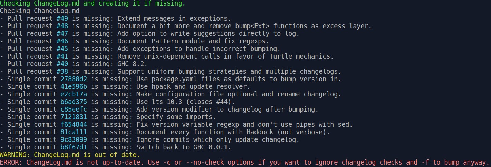
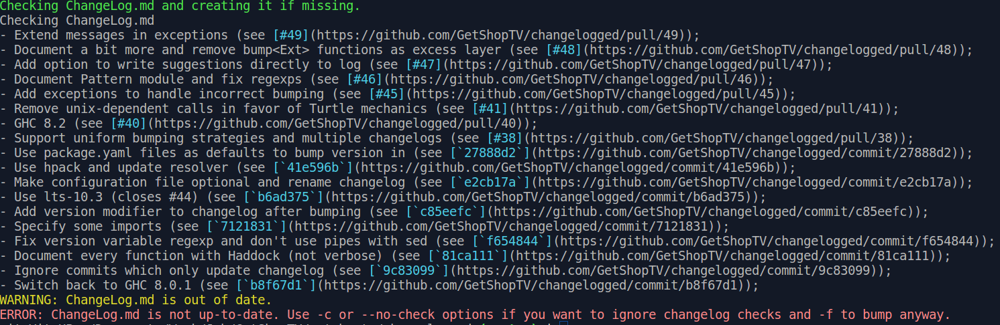
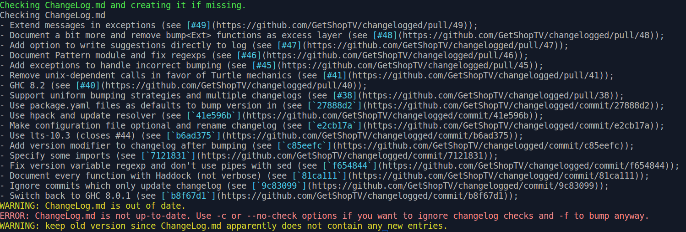
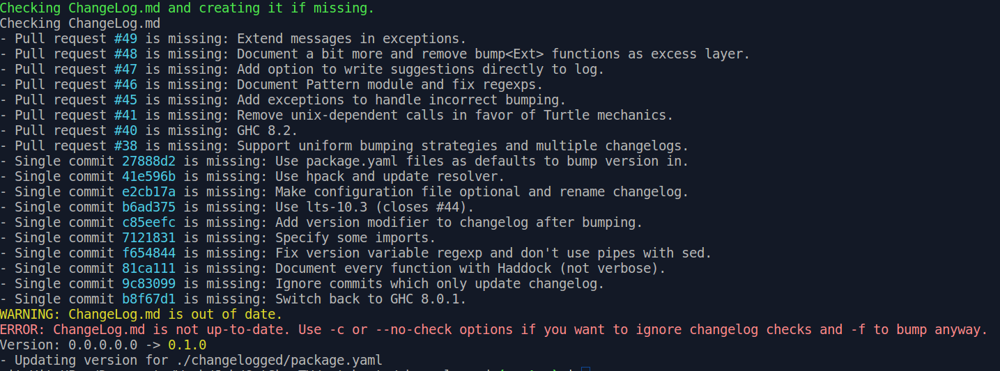
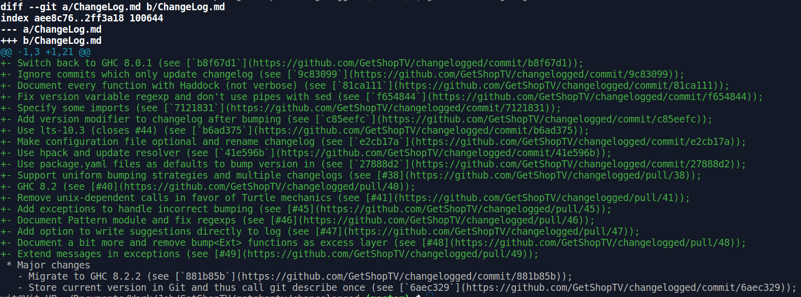
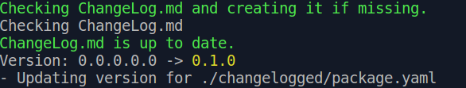
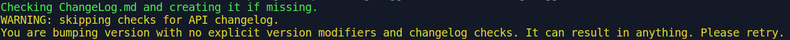

### This it the tool for tracking project history.

It can check if your changelogs are up to date, suggest changes you've missed and bump versions in given files automatically.
It takes almost all data from git.

It can also write suggestions directly to changelog if you ask.

It supports multiple special changelogs and can bump version in different files.
You can specify all paths in config named `changelogged.yaml` and see example in `changelogged.yaml.skel`.
Config is optional. With no it will check default `ChangeLog.md` and bump version in `project.yaml` files around the project.
(Suggestion - if you have to bump version in the file you use as indicator, write it last.
Thus if you were wrong in some previous field you will get correct version after fix and rerun with no need to roll back bumping in indicator.)

It was written in Haskell and for Haskell first.
So now it supports only `.cabal`, `.yaml`, `.hs` and `.json` files to bump version in and to get version relevant to local changelog from.
There is an [issue](https://github.com/GetShopTV/changelogged/issues/35) where you can call for new extensions.
And it's easy to add them yourself in local copy or fork (and hopefully make PR). It will be documented on first demand.

Version relevant to common changelog is known from git.

Text of help message:
```
This tool can check your changelogs and bump versions in project.
It assumes to be run in root directory of project and that changelog is here.
You can specify these levels of changes: app, major, minor, fix, doc.
It can infer version from changelog.
But it will refuse to do it if it's not sure changelogs are up to date.

Usage: changelogged [-l|--level ARG] [-a|--api-level ARG] [--format ARG]
                    [-W|--with-api] [-m|--multiple] [-c|--no-check]
                    [-C|--no-bump] [-e|--from-bc] [-f|--force] [-y|--write]

Available options:
  -h,--help                Show this help text
  -l,--level ARG           Level of changes (for packages). One of (app major
                           minor fix doc)
  -a,--api-level ARG       Level of changes (for API). One of (app major minor
                           fix doc)
  --format ARG             Warning format. One of (simple
                           suggest) (default: simple)
  -W,--with-api            Assume there is changelog for API.
  -m,--multiple            Assume there is more than one changelog.
  -c,--no-check            Do not check changelogs.
  -C,--no-bump             Do not bump versions. Only check changelogs.
  -e,--from-bc             Check changelogs from start of project.
  -f,--force               Bump version even if changelogs are outdated. Cannot
                           be mixed with -c.
  -y,--write               Write changelog suggestions to changelog directly.
                           Available with --format suggest.
```

### Guiding examples:

#### Common run:
```
changelogged (master):$ changelogged
```


#### Suggest changelog entries:
```
changelogged (master):$ changelogged --format suggest
```


Force with no entries in changelog:
```
changelogged (master):$ changelogged --format suggest -f
```


Force with explicit version:
```
changelogged (master):$ changelogged -f -l major
```


#### Write suggested entries to changelog (works only with `--format suggest`)
```
changelogged (master):$ changelogged --format suggest -y
```

```
changelogged (master):$ git diff ChangeLog.md
```

It requires some manual editing after. And it will not bump version immediately.

#### Bump version infering it from changelog:
```
changelogged (master):$ changelogged --format suggest -y
```

```
changelogged (master):$ git diff ChangeLog.md
```


Do not bump even if changelogs are up to date
```
changelogged -C
```


Try to bump without checking changelogs. Seems that `-f` option is always preferrable. But it waits fr use cases.
```
chagelogged -c
```


### Suggested simple workflow on release (for project with no `changelogged.yaml`):

You can see example of configuration in `changelogged.yaml.skel` file.

```
changelogged -C
```
```
changelogged --format suggest -y
```
Manually edit changelog
```
changelogged
```
Next part is subject to change:

Commit bumping versions.
```
changelogged --format suggest -y
```
Edit changelog - move new entry under version milestone.
Note: changes in `.md` files are ignored.

commit changelog, push and release.
