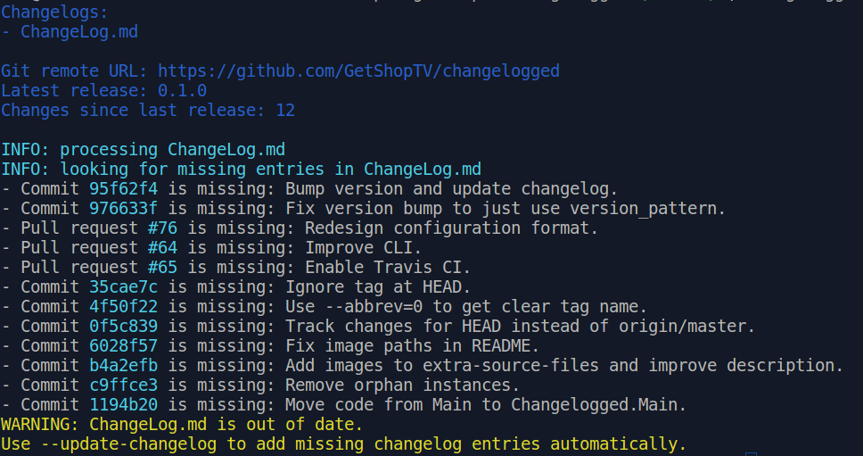
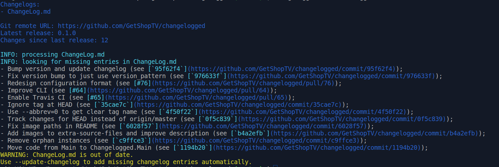
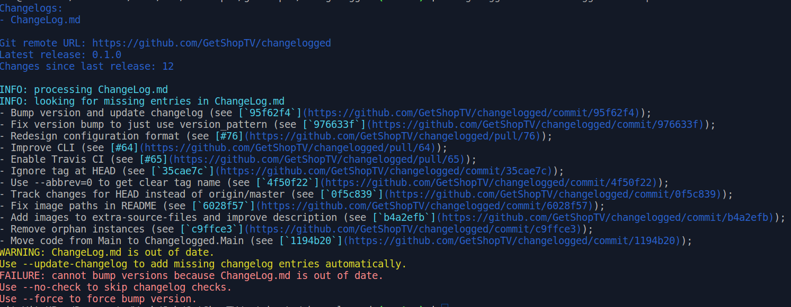
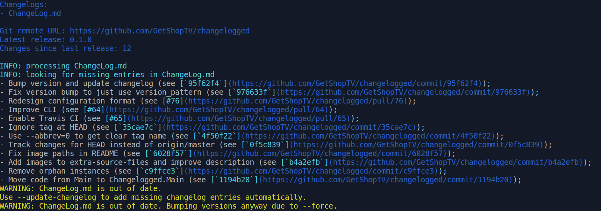
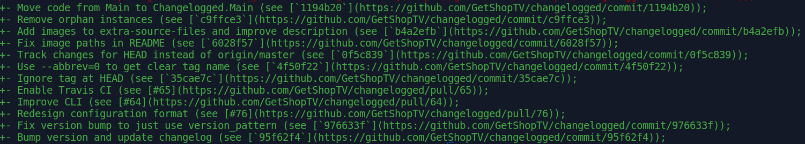
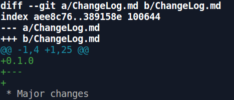
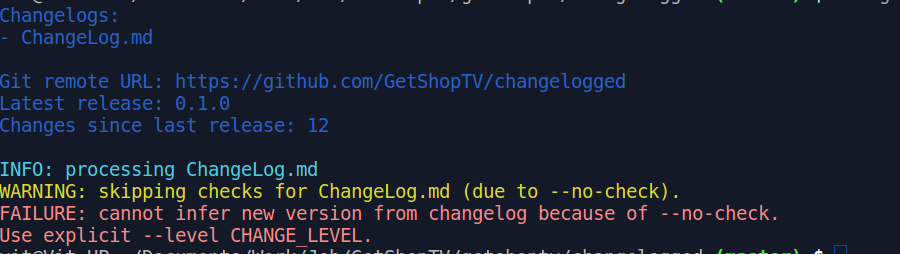

# changelogged

[](http://hackage.haskell.org/package/changelogged)
[](https://travis-ci.org/GetShopTV/changelogged)

`changelogged` is a changelog manager for Git projects.


## Quick start

You're encouraged to use `changelogged` when preparing a new release of your project.

For most projects you can start by simply running `changelogged` with no options or configuration files:

```
changelogged
```

That should print out some inferred information about your project
and also list any recent changes that are not included in you changelog.

You can then prepend missing changelog entries automatically with

```
changelogged --update-changelog --format suggest
```

Now you can see new entries in your changelog, make edits and group changes.
When you're done you can automatically bump project's version with

```
changelogged --bump-versions
```

That's it! Now you have a proper changelog with no forgotten changes.

### A note for Git Flow projects

With Git Flow your development and feature branches
will likely not have version tags associated with them.
This can confuse `changelogged` and result in more suggestions than needed.

To avoid this situation add [`branch: master` line](https://github.com/GetShopTV/changelogged/blob/master/.changelogged.template.yaml#L37-L41)
in your `.changelogged.yaml`.

## Configuration file

For any non-trivial project you're likely to want to configure the way `changelogged`
treats changes in that project.
Normally configuration file is located at `.changelogged.yaml` (note the leading dot).

See [.changelogged.template.yaml](.changelogged.template.yaml)
for a template configuration file with description of all fields.

## Feature reference

### Help message

```
changelogged --help
```

```
changelogged - Changelog Manager for Git Projects

Usage: changelogged [--format FORMAT] [--update-changelog] [--bump-versions]

Available options:
  -h,--help                Show this help text
  --format FORMAT          Missing entries report format. FORMAT can be 'simple'
                           or 'suggest'. (default: simple)
  --update-changelog       Prepend missing entries to changelogs. Available with
                           --format=suggest.
  --bump-versions          Bump versions according to change level.
  --level CHANGE_LEVEL     Level of changes (for packages). CHANGE_LEVEL can be
                           'app', 'major', 'minor', 'fix' or 'doc'.
  --api-level CHANGE_LEVEL Level of changes (for API). CHANGE_LEVEL can be
                           'app', 'major', 'minor', 'fix' or 'doc'.
  --from-bc                Check changelogs for the entire history of the
                           project.
  --force                  Bump versions even when changelogs are outdated.
  --no-check               Do not check changelogs.
```

See examples [below](#guiding-examples)

### Checking changelogs

This is default feature. Changelogged will output all missing pull requests and commits with their messages.

You can skip it with `--no-check` option or ignore results with `--force` option. Also you can check changelog from the first commit with `--from-bc`.

### Bumping versions

If changelogs are up to day changelogged will bump versions all over the project with option `--bump-versions`.

You can variously combine changelog checking and bumping versions. For example you may just want to be sure changelogs are up to date. You can just run `changelogged`
By default new version is inferred from changelog. It will work if you have some of `* App...` `* Major...`, `* Minor...`, `* Fix...`, and `* Doc...` sections in changelog and name versions correspondingly.
Suggested versioning: `app.major.minor.fix.doc`.
Otherwise you can specify new version explicitly with `--level` option. It's also the only way to work with `--no-check` option.
This option is subject to change significantly and is broken now.

### Multiple changelogs and subversions

If you have a lot of changelog entries in `changelogged.yaml` you get it. There is no option to set explicit subversion for any changelog. `--api-level` is already deprecated.
Also there will be option to check changelog passed by name in commang line args if it presents in config.

### Writing changelogs.

`--format suggest` provides another format for records you see on the screen.
It can be used with `--update-changelog` option to write these strings to the top of changelog they are relevant to.
It's recommended to edit it manually after.
This option cannot be used with `--format simple` which is default.

## Guiding examples

### Default run without options

```
changelogged
```



### Suggest changelog entries

```
changelogged --format suggest
```



Try to bump with no entries in changelog:

```
changelogged --format suggest --bump-versions
```



Force with no entries in changelog:

```
changelogged --format suggest --bump-versions --force
```



### Write suggested entries to changelog

```
changelogged --format suggest --update-changelog
```


```
$ git diff ChangeLog.md
```



It requires some manual editing after.

### Bump version and infering level of change from changelog

```
changelogged --format suggest --bump-versions
```


```
git diff ChangeLog.md
```



Try to bump without checking changelogs.
Seems that `--force` option is always preferrable.
But it waits for use cases.

```
changelogged --no-check
```



## Development

### Requirements

It works with Git projects only.
It was never tested on Windows. Ideally it will work if you have Git Bash installed.

### Getting and building

For now the only way to get `changelogged` is to build it from source.

#### Installing from Hackage

You can build a version from Hackage using Stack or cabal-install:

```
stack install changelogged
```

```
cabal install changelogged
```

#### Using latest code from GitHub

Clone this repository:

```
git clone https://github.com/GetShopTV/changelogged.git
```

`cd` into cloned repository and build with Stack:

```
stack build
```

You can now run `changelogged` via Stack with

```
stack exec changelogged
```

or you can install it with

```
stack install
```

## Contributing

Bug reports and feature requests are welcome on
[GitHub](https://github.com/GetShopTV/changelogged/issues)

Pull requests are welcome!

_GetShop.TV Team_
