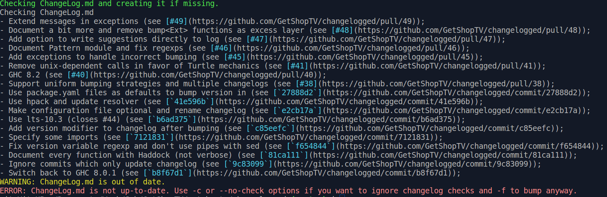
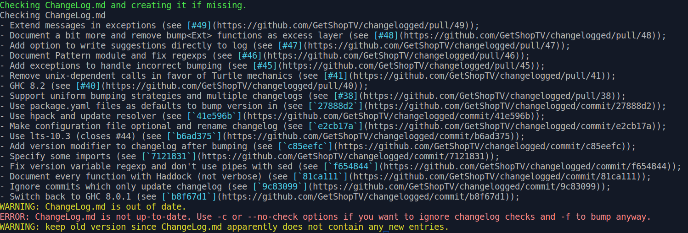
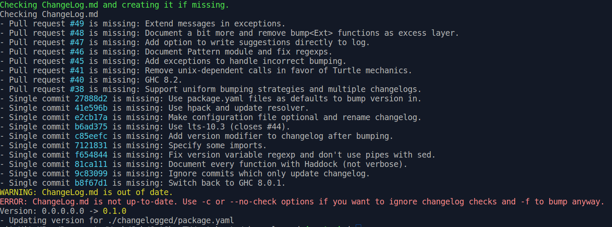
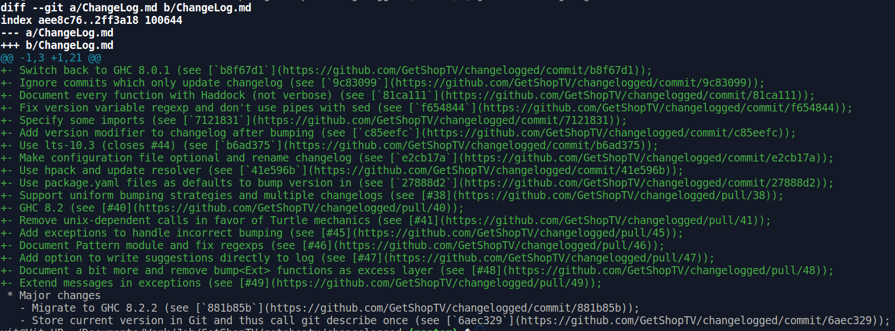
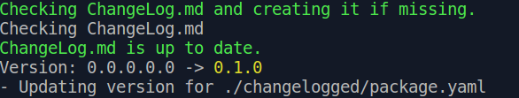
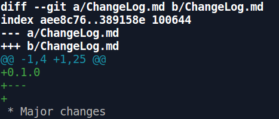
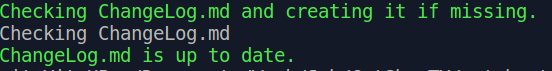
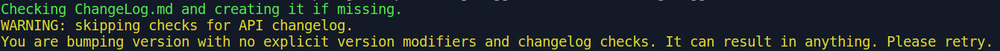

# Changelogged

## What and how to?

### Purpose
This is the tool for tracking project history and release documentation.
It guides developer through writing changelogs are bump version in project files.
With proper usage it guarantees that every pull request or commit from git history is mentioned in project changelogs and that versions all over the project are up to date.
It can also write changelogs based on git history and infer new version from changelog if it contains rubrication by level of changes.

### Configuration file
[example](changelogged.yaml.skel)
```
changelogs:
  main:
    # You can simply use arrays here.
    path: "CHANGELOG.md"
  api:
    path: "API_CHANGELOG.md"
    indicator:
      path: "file.json"
      variable: "version"
versioned:
  main:
  - path: "file.cabal"
    variable: "version"
  - path: "file2.cabal"
    variable: "version"
  - path: "file3.hs"
    variable: "version"
  - path: "file4.json"
    variable: "version"
  api:
  - path: "file.hs"
    variable: "apiVersion"
  - path: "file.json"
    variable: "version"
```

Config is optional.
With no config tool will try to check file named `ChangeLog.md` as far as it's part of Stack project template and bump versions in `package.yaml` files all over the project.

Config (named `changelogged.yaml`) is split in two sections.

`changelogs` record contains records about each changelog to track.
Each changelog has a key - key of the record. Two keys are reserved - `main` and `api` for common project changelog and API changelog correspondingly.
For each key there is a value. `path` is path to changelog from directory where you intent to run `changelogged`. `indicator` is optional.
`indicator` is used e.g. for API changelogs - it's file such that changing this file is equivalent to change API. This record contains `path` to file and `variable` where version is stored.
Current version for parts tracked by local changelogs is known from `indicator`. That's why `variable` key persists. General version of project is known from latest git tag.

`versioned` section contains same key-names as `changelogs`. Each key contains array of files with `path` to file and `variable` where version is stored.

### Features reference

#### Text of help message:
```
This tool can check your changelogs and bump versions in project.
It assumes to be run in root directory of project and that changelog is here.
You can specify these levels of changes: app, major, minor, fix, doc.
It can infer version from changelog.
But it will refuse to do it if it's not sure changelogs are up to date.

Usage: changelogged [-l|--level ARG] [-a|--api-level ARG] [--format ARG]
                    [-W|--with-api] [-m|--multiple] [-c|--no-check]
                    [-C|--no-bump] [-e|--from-bc] [-f|--force] [-y|--write]

Available options:
  -h,--help                Show this help text
  -l,--level ARG           Level of changes (for packages). One of (app major
                           minor fix doc)
  -a,--api-level ARG       Level of changes (for API). One of (app major minor
                           fix doc)
  --format ARG             Warning format. One of (simple
                           suggest) (default: simple)
  -W,--with-api            Assume there is changelog for API.
  -m,--multiple            Assume there is more than one changelog.
  -c,--no-check            Do not check changelogs.
  -C,--no-bump             Do not bump versions. Only check changelogs.
  -e,--from-bc             Check changelogs from start of project.
  -f,--force               Bump version even if changelogs are outdated. Cannot
                           be mixed with -c.
  -y,--write               Write changelog suggestions to changelog directly.
                           Available with --format suggest.
```

See examples [below](#guiding-examples)

#### Checking changelogs
This is default feature. Changelogged will output all missing pull requests and commits with their messages.
It ignores commits and pull requests affecting only `.md` files.

You can skip it with `-c` option or ignore results with `-f` option. Also you can check changelog from the first commit with `-e`.

#### Bumping versions
This is also default feature. In default way if changelogs are up to day changelogged will bump versions all over the project.

You can variously combine changelog checking and bumping versions. For example you may just want to be sure changelogs are up to date. There is `-C` option for that.
By default new version is inferred from changelog. It will work if you have some of `* App...` `* Major...`, `* Minor...`, `* Fix...`, and `* Doc...` sections in changelog and name versions correspondingly.
Suggested versioning: `app.major.minor.fix.doc`.
Otherwise you can specify new version explicitly with `-l` option. It's also the only way to work with `-c` option.

#### Multiple changelogs and subversions
This feature requires `changelogged.yaml`.

With `-m` option tool will assume there is more than one changelog and check all of them by keys from configuration file. Here is also subversioning from the box.
Current version is known from indicator file and new version is known from changelog.

You cannot explicitly set new version for arbitrary changelog but `-W` option provides special checking of API changelog. And you can set new version with `-a`.
It's impossible to check only API changelog for now. See [issue](https://github.com/GetShopTV/changelogged/issues/54).

#### Writing changelogs.
`--format suggest` provides another format for records you see on the screen.
It can be used with `-y` option to write these strings to the top of changelog they are relevant to.
This option cannot be used with `--format simple` which is default.

### Guiding examples:

#### Common run:
```
changelogged (master):$ changelogged
```


#### Suggest changelog entries:
```
changelogged (master):$ changelogged --format suggest
```


Force with no entries in changelog:
```
changelogged (master):$ changelogged --format suggest -f
```


Force with explicit version:
```
changelogged (master):$ changelogged -f -l major
```


#### Write suggested entries to changelog (works only with `--format suggest`)
```
changelogged (master):$ changelogged --format suggest -y
```

```
changelogged (master):$ git diff ChangeLog.md
```

It requires some manual editing after. And it will not bump version immediately.

#### Bump version infering it from changelog:
```
changelogged (master):$ changelogged --format suggest -y
```

```
changelogged (master):$ git diff ChangeLog.md
```


Do not bump even if changelogs are up to date
```
changelogged -C
```


Try to bump without checking changelogs. Seems that `-f` option is always preferrable. But it waits for use cases.
```
chagelogged -c
```


### Typical daily workflow to keep project and API changelogs up to date (assuming existing changelogged.yaml):
See missing entries:
```
changelogged -C --format suggest -W
```
Record these changes.
```
changelogged --format suggest -W -y
```
And then edit changelogs manually.

### Suggested simple workflow on release (for project with no `changelogged.yaml` and API CHANGELOG):
See missing entries:
```
changelogged -C
```
Record these changes:
```
changelogged --format suggest -y
```
Manually edit changelog

Bump versions:
```
changelogged
```
_Next part is subject to change:_

Commit files with bumped versions.

Record commit with version bumps:
```
changelogged --format suggest -y
```
Edit changelog - move new entry under version milestone.
Note: changes in `.md` files are ignored.

Commit changelog, push and release.

## Setting up

### Requirements
It works with git projects only.
It was never tested on Windows. Ideally it will work if you have Git Bash installed.
As tool was designed for Haskell ecosystem first there are these extensions supported: `.hs`, `.cabal`, `.yaml` and `.json`. You cannot bump version in any other file.
But new extensions can be easily provided as far as changelogged aims to have the most wide users community. See [Add new extension](#add-new-extension) section. 

### Getting and building
First of all you should go to project [Github](https://github.com/GetShopTV/changelogged)

Then you can simply download it - there is a binary in `bin` directory. After execute something like `cp bin/changelogged ~/.local/bin`.

Or you can clone repo and build it from source. You need latest [Stack](https://docs.haskellstack.org/en/stable/README/) installed.
To build run
```
stack install
```

## Contributing

### Common
Bug reports and feature requests are welcome on [Github](https://github.com/GetShopTV/changelogged/issues)

You are free to fork project and make a pull request.

### Add new extension
You may want to use this tool inside project written not in Haskell. You are very welcome.

Version bumping is restricted with extension of file. There is no euristic rules like "version is placed in `version = `" to have determined behaviour.
You may request for extension you want to be supported in [special issue](https://github.com/GetShopTV/changelogged/issues/35). It will be here ASAP.
Or you may write it yourself.
You are welcome to ask about how in comments in that issue (or browse comments).
